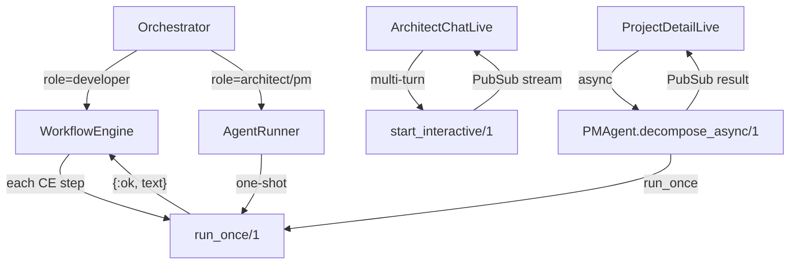

# Core Runtime Split & Orchestrator Integration

## Overview

The Anarchy core has 7 systemic issues where the implementation diverges from the spec: single-mode runtime conflating one-shot and interactive, orchestrator bypassing the CE loop, broken PubSub wiring, and silent output loss. This plan fixes them in dependency order across 2 phases.

## Problem Statement

1. **ClaudeCode runtime is single-mode** — always uses `-p` flag, making every invocation fire-and-forget. No way to hold interactive sessions.
2. **`execute_claude_code_role` returns `:ok`** — the #1 critical bug. All CE review classification, architect chat responses, and PM agent output is lost.
3. **Double prompt bug** — prompt sent via `-p` AND `send_prompt`, Claude sees it twice.
4. **Orchestrator never calls WorkflowEngine** — CE loop exists but is disconnected from main dispatch.
5. **4/7 PubSub topics are dead** — consumers subscribe but no producer broadcasts.
6. **ArchitectChatLive uses bare `spawn`** — unmonitored, no streaming, one-shot per message.
7. **PM decomposition blocks LiveView** — synchronous call freezes UI.

## Technical Approach

### Dependency Graph

```
Phase A: Runtime split + RoleLoader fix + WorkflowEngine hardening
    ↓
Phase B: Orchestrator dispatch + PubSub wiring + ArchitectChat + PM async
```

### Architecture



### Implementation Phases

#### Phase A: Runtime Split + RoleLoader + WorkflowEngine

**Goal**: Two execution modes in ClaudeCode. RoleLoader returns text. WorkflowEngine classifies real output.

##### Step A1: Add `run_once/1` to ClaudeCode

`core/lib/anarchy/runtime/claude_code.ex`

```elixir
@doc """
One-shot Claude Code execution. Blocks caller until completion.
Returns {:ok, text} or {:error, reason}.
"""
@spec run_once(keyword()) :: {:ok, String.t()} | {:error, term()}
def run_once(opts) do
  args = build_run_once_args(opts)
  executable = find_claude_executable()
  port_opts = [:binary, :exit_status, :use_stdio, args: args]
  port_opts = if opts[:workspace_path], do: [{:cd, opts[:workspace_path]} | port_opts], else: port_opts

  port = Port.open({:spawn_executable, executable}, port_opts)
  collect_output(port, "", "", opts[:timeout] || 3_600_000)
end

defp build_run_once_args(opts) do
  base = ["-p", opts[:prompt] || "", "--output-format", "stream-json"]
  base = if skip_permissions?(), do: ["--dangerously-skip-permissions" | base], else: base
  base
  |> maybe_add("--model", opts[:model])
  |> maybe_add("--system-prompt", opts[:system_prompt])
  |> maybe_add("--max-budget-usd", opts[:budget])
end

# remaining = unparsed buffer fragment (NOT full history)
# acc_text = accumulated final text
defp collect_output(port, remaining, acc_text, timeout) do
  receive do
    {^port, {:data, data}} ->
      {messages, new_remaining} = parse_stream_json(remaining <> data)
      new_text = extract_result_text(messages)
      collect_output(port, new_remaining, acc_text <> new_text, timeout)

    {^port, {:exit_status, 0}} ->
      # Parse any remaining buffer
      {messages, _} = parse_stream_json(remaining)
      final_text = acc_text <> extract_result_text(messages)
      if final_text == "", do: {:error, :empty_output}, else: {:ok, final_text}

    {^port, {:exit_status, status}} ->
      {:error, {:exit_status, status}}
  after
    timeout ->
      Port.close(port)
      {:error, :timeout}
  end
end

defp extract_result_text(messages) do
  Enum.flat_map(messages, fn
    %{"type" => "result", "result" => text} when is_binary(text) -> [text]
    _ -> []
  end)
  |> Enum.join("")
end
```

Key decisions:
- `run_once/1` is a **plain function**, not a GenServer — caller blocks until Port exits
- `remaining` tracks only unparsed buffer fragment (NOT full history) — avoids O(n^2) re-parsing
- No intermediate PubSub broadcasting — one-shot callers consume the return value
- Port cleanup on timeout via `Port.close/1`

##### Step A2: Add `start_interactive/1` and `send_message/2`

```elixir
@doc "Start interactive Claude session (no -p). Returns {:ok, session_id, pid}."
@spec start_interactive(keyword()) :: {:ok, String.t(), pid()}
def start_interactive(opts) do
  opts = Map.put(opts, :mode, :interactive)
  {:ok, pid} = GenServer.start_link(__MODULE__, opts)
  session_id = GenServer.call(pid, :get_session_id)
  {:ok, session_id, pid}
end

@doc "Send message to interactive session."
@spec send_message(pid(), String.t()) :: :ok
def send_message(pid, message) do
  GenServer.cast(pid, {:send_prompt, message})
end
```

Update `init/1` to handle `:interactive` mode:

```elixir
def init(%{mode: :interactive} = opts) do
  session_id = opts[:session_id] || generate_session_id()
  args = build_interactive_args(opts)  # NO -p flag
  port = open_port(args, opts[:workspace_path])
  {:ok, %__MODULE__{port: port, session_id: session_id, on_message: opts[:on_message], buffer: ""}}
end

defp build_interactive_args(opts) do
  base = ["--output-format", "stream-json"]
  base = if skip_permissions?(), do: ["--dangerously-skip-permissions" | base], else: base
  base
  |> maybe_add("--model", opts[:model])
  |> maybe_add("--system-prompt", opts[:system_prompt])
end
```

##### Step A3: Remove `start_session/1` and `send_prompt/2`

Delete entirely — not deprecate-and-keep. Only 2 callers:
- `RoleLoader.execute_claude_code_role` → switches to `run_once/1` in Step A4
- `handle_cast({:send_prompt, ...})` inside the GenServer → stays as internal handler for `send_message/2`

Update `AgentProtocol` behaviour:
- Replace `start_session/1` with `run_once/1` and `start_interactive/1`
- Replace `send_prompt/2` with `send_message/2`
- Keep `resume_session/1` and `stop_session/1`

##### Step A4: Fix `execute_claude_code_role/5` in RoleLoader

`core/lib/anarchy/role_loader.ex`

Current bug: sends prompt via `-p` AND `send_prompt`, returns `:ok`.

```elixir
defp execute_claude_code_role(role, _task, workspace_path, prompt, system_prompt) do
  ClaudeCode.run_once(
    prompt: prompt,
    model: model_for(role),
    system_prompt: system_prompt,
    workspace_path: workspace_path
  )
end
```

Returns `{:ok, text}` | `{:error, reason}` directly from `run_once/1`. No wrapping needed.

Update `execute_role/4` return type to propagate the tagged tuple.

##### Step A5: Fix WorkflowEngine classification + worker propagation

`core/lib/anarchy/workflow_engine.ex`

**classify_review_result — handle both old `:ok` and new `{:ok, text}` patterns:**

```elixir
defp classify_review_result({:ok, text}) when is_binary(text) and text != "" do
  lower = String.downcase(text)
  cond do
    String.contains?(lower, "critical") -> :critical_found
    String.contains?(lower, "revision") or String.contains?(lower, "revise") -> :revision_needed
    String.contains?(lower, "approved") or String.contains?(lower, "lgtm") -> :approved
    true -> :revision_needed  # Conservative default
  end
end

defp classify_review_result(_), do: :revision_needed
```

**Fix `spawn_monitor` result propagation:**

```elixir
defp spawn_role_worker(role, data, prompt) do
  caller = self()
  {pid, ref} = spawn_monitor(fn ->
    try do
      result = RoleLoader.execute_role(role, data.task, data.workspace_path, prompt)
      send(caller, {:worker_complete, :normal, result})
    catch
      kind, reason ->
        send(caller, {:worker_complete, :error, {kind, reason, __STACKTRACE__}})
    end
  end)
  %{data | worker_pid: pid, worker_ref: ref}
end
```

##### Step A6: Verify Claude Code CLI interactive mode

- [ ] Test: `claude --output-format stream-json` without `-p` accepts stdin input
- [ ] Test: multi-turn conversation via stdin newlines

**Acceptance criteria (Phase A):**
- [x] `run_once/1` returns `{:ok, "text"}` for a simple prompt
- [x] `run_once/1` returns `{:error, :timeout}` when timeout fires
- [x] `start_interactive/1` keeps Port alive across multiple `send_message/2` calls
- [x] Port killed on GenServer terminate
- [x] `execute_role(:developer, ...)` returns `{:ok, "code output text"}`
- [x] `classify_review_result({:ok, "approved"})` returns `:approved`
- [x] `classify_review_result(:ok)` returns `:revision_needed`
- [x] `classify_review_result(nil)` returns `:revision_needed`
- [x] Worker errors propagated correctly (not silently converted to `:normal`)
- [x] `start_session/1` and `send_prompt/2` removed from public API
- [x] All existing tests pass (255 tests, 0 failures)

---

#### Phase B: Orchestrator Dispatch + PubSub + ArchitectChat + PM Async

**Goal**: Orchestrator routes CE-loop roles through WorkflowEngine. PubSub topics wired. Architect chat is interactive. PM decomposition is async.

##### Step B1: Add dispatch decision to Orchestrator

`core/lib/anarchy/orchestrator.ex`

```elixir
defp dispatch_mode(role) when role in [:developer, :ce_reviewer, :plan_reviewer, :code_reviewer], do: :ce_loop
defp dispatch_mode(_role), do: :direct

defp do_dispatch_task(task, recipient, state) do
  case dispatch_mode(recipient) do
    :ce_loop -> dispatch_ce_loop(task, state)
    :direct -> dispatch_direct(task, recipient, state)
  end
end
```

##### Step B2: CE-loop dispatch via Oban

```elixir
defp dispatch_ce_loop(task, state) do
  case CELoopWorker.enqueue(task.id, task.project_id) do
    {:ok, _job} ->
      Logger.info("Enqueued CE loop for task #{task.id}")
      state
    {:error, reason} ->
      Logger.warning("Failed to enqueue CE loop for task #{task.id}: #{inspect(reason)}")
      state
  end
end
```

No `running` map entry for CE-loop tasks. Oban owns the lifecycle. Existing `reconcile_running_tasks` detects terminal status via DB on next poll tick.

##### Step B3: Direct dispatch (existing path, extracted)

```elixir
defp dispatch_direct(task, recipient, state) do
  # Existing Task.Supervisor.start_child + AgentRunner.run logic
  ...
end
```

##### Step B4: Wire PubSub producers in Tracker

`core/lib/anarchy/tracker/postgres.ex`

```elixir
def update_task_state(task_id, new_status) do
  # ... existing DB update ...
  Phoenix.PubSub.broadcast(Anarchy.PubSub, "task:#{task_id}", {:task_updated, task})
  Phoenix.PubSub.broadcast(Anarchy.PubSub, "project:#{task.project_id}", {:task_status_changed, task_id, new_status})
end
```

This is the **single source of broadcast** — WorkflowEngine does NOT broadcast separately.

##### Step B5: Remove dead subscriptions

- `AgentMapLive`: remove subscription to `agents:<project_id>`
- Keep `project:<id>` (now has producer) and `mail:project:<id>` (already working)

##### Step B6: Rebuild ArchitectChatLive

`core/lib/anarchy_web/live/architect_chat_live.ex`

```elixir
def mount(%{"project_id" => project_id}, _session, socket) do
  if connected?(socket) do
    {session_id, claude_pid} = get_or_start_architect_session(project_id)
    Phoenix.PubSub.subscribe(Anarchy.PubSub, "agent:#{session_id}")

    {:ok, assign(socket,
      project_id: project_id,
      session_id: session_id,
      claude_pid: claude_pid,
      messages: [],
      streaming: false,
      stream_buffer: ""
    )}
  else
    {:ok, assign(socket, project_id: project_id, messages: [], streaming: false, stream_buffer: "")}
  end
end

def handle_event("send_message", %{"message" => text}, socket) do
  ClaudeCode.send_message(socket.assigns.claude_pid, text)
  messages = socket.assigns.messages ++ [%{role: "user", content: text}]
  {:noreply, assign(socket, messages: messages, streaming: true, stream_buffer: "")}
end

# IMPORTANT: Specific clause FIRST — "result" type completes streaming
def handle_info({:agent_output, _sid, %{"type" => "result"} = _msg}, socket) do
  final_text = socket.assigns.stream_buffer
  messages = socket.assigns.messages ++ [%{role: "assistant", content: final_text}]
  {:noreply, assign(socket, messages: messages, streaming: false, stream_buffer: "")}
end

# Generic clause SECOND — accumulate streaming chunks
def handle_info({:agent_output, _session_id, msg}, socket) do
  case extract_text_chunk(msg) do
    nil -> {:noreply, socket}
    chunk ->
      buffer = socket.assigns.stream_buffer <> chunk
      {:noreply, assign(socket, stream_buffer: buffer)}
  end
end
```

Messages stored in socket assigns only — no ChatHistory module/table. Claude Code `--resume` provides conversation continuity across reconnects.

##### Step B7: Add `PMAgent.decompose_async/1`

`core/lib/anarchy/pm_agent.ex`

```elixir
def decompose_async(design) do
  project_id = design.project_id
  Task.Supervisor.start_child(Anarchy.TaskSupervisor, fn ->
    Repo.transaction(fn ->
      case decompose_with_agent(design) do
        {:ok, tasks} ->
          Phoenix.PubSub.broadcast(Anarchy.PubSub, "project:#{project_id}", {:tasks_created, design.id, tasks})
        {:error, reason} ->
          Repo.rollback(reason)
      end
    end)
    |> case do
      {:error, reason} ->
        Phoenix.PubSub.broadcast(Anarchy.PubSub, "project:#{project_id}", {:pm_error, design.id, reason})
      _ -> :ok
    end
  end)
end
```

Task creation wrapped in `Repo.transaction` to prevent partial creates.

Update `ProjectDetailLive` to handle `{:tasks_created, ...}` and `{:pm_error, ...}`.

**Acceptance criteria (Phase B):**
- [ ] Developer tasks dispatch through CE loop (WorkflowEngine via Oban)
- [ ] Architect/PM tasks dispatch directly (existing AgentRunner path)
- [ ] `TaskDetailLive` receives live updates on `task:<id>` topic
- [ ] `ProjectDetailLive` receives `{:task_status_changed, ...}` events
- [ ] No LiveView subscribes to a topic without a producer
- [ ] Architect second message continues same conversation
- [ ] Streaming chunks appear incrementally in chat UI
- [ ] PM "Confirm" triggers async decomposition with flash message
- [ ] PM task creation is transactional (all-or-nothing)

---

## System-Wide Impact

### Error Propagation

- `run_once/1` returns `{:error, reason}` → `execute_role` propagates → worker sends `{:worker_complete, :error, ...}` → WorkflowEngine retries or fails
- Port timeout → `Port.close/1` → `{:error, :timeout}` → same chain
- WorkflowEngine crash → Oban retries job → restarts from idle

### State Lifecycle Risks

- **CE loop crash mid-state**: In-memory state lost. Oban retry restarts from `:idle`. Mitigation: Tracker broadcasts on each state change keep LiveViews accurate.
- **Architect session orphan**: Claude process alive with no LiveView. Mitigation: idle timeout + periodic cleanup.
- **Partial PM task creation**: Wrapped in `Repo.transaction` — all-or-nothing.

---

## Dependencies & Prerequisites

- Phase A has no deps (start immediately)
- Phase B depends on Phase A (`run_once/1`, `start_interactive/1`, fixed classification)

### External dependency to verify

- [ ] Claude Code CLI behavior without `-p` flag — does it accept stdin for interactive multi-turn?

## Risk Analysis & Mitigation

| Risk | Impact | Probability | Mitigation |
|------|--------|-------------|------------|
| Claude CLI doesn't support interactive stdin | Blocks architect chat | Low | Test first. Fallback: `--resume` per message |
| stream-json output format differs from assumed schema | `extract_result_text` returns empty | Medium | Integration test against real CLI output |
| Oban `:ce_loops` queue undersized | CE loop dispatch blocks | Low | Document queue concurrency must match `max_concurrent_agents` |

## Out of Scope

- Full session history browser UI / ChatHistory persistence
- Diff browser UI
- Multi-node WorkflowEngine coordination
- SessionManager refactor (GenServer → module)
- StatusDashboard cleanup (normalize_status_lines, keyword_override)
- Review cycle limit counter (defer until observed in practice)

## Sources & References

- **Origin spec**: [docs/plans/core-fix-validation-and-design.md](../plans/core-fix-validation-and-design.md)
- **Phase 1 learnings**: [docs/solutions/phase1-core-learnings.md](../solutions/phase1-core-learnings.md) — Port termination, N+1 prevention, guard clauses
- **Runtime security learnings**: [docs/solutions/runtime-fixes-security-learnings.md](../solutions/runtime-fixes-security-learnings.md) — fail-closed defaults
- Current runtime: `core/lib/anarchy/runtime/claude_code.ex`
- WorkflowEngine: `core/lib/anarchy/workflow_engine.ex`
- Orchestrator: `core/lib/anarchy/orchestrator.ex`
- RoleLoader: `core/lib/anarchy/role_loader.ex`

## Plan Review Revisions Applied

1. **R1**: Fixed `collect_output` — uses `remaining` buffer pattern, not full `acc` re-parse (avoids O(n^2))
2. **R2**: ArchitectChatLive `handle_info` — `%{"type" => "result"}` clause listed FIRST
3. **R3**: `classify_review_result({:ok, text})` moved to Phase A (was Phase 4)
4. **S1**: 4 phases → 2 phases (A: runtime+RoleLoader+WE, B: everything else)
5. **S2**: Removed ChatHistory module/table — messages in socket assigns only
6. **S3**: Removed `on_stream` callback and PubSub from `run_once/1` — returns text only
7. **S4**: `send_prompt/2` removed entirely, not deprecated-and-kept
8. **S5**: Removed WorkflowEngine `broadcast_state_change` — Tracker is single broadcast source
9. **S6**: No CE-loop entries in Orchestrator `running` map — Oban owns lifecycle, DB reconciliation detects completion
10. **S7**: Deferred `review_cycles` counter — existing `max_attempts` handles crash retries
